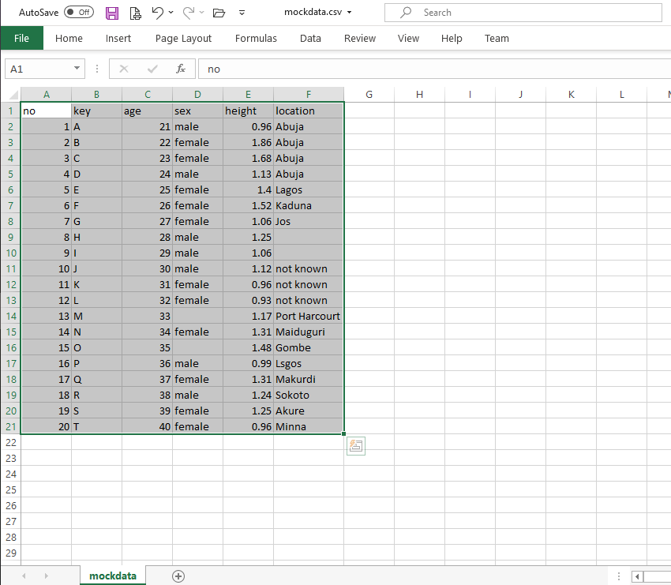

```{r setup, include=FALSE}
knitr::opts_chunk$set(echo = TRUE)

try({
  pkgs <- c("naijR", "purrr")
  pkgNoDey <- !sapply(pkgs, requireNamespace, quietly = TRUE)
  install.packages(pkgs[pkgNoDey], repos = 'https://cran.rstudio.com')
}, silent = TRUE
)

sections <- list(
  what = "What is R?",
  get = "Getting R",
  syntax = "R syntax",
  use = "Practical Uses",
  prospect = "Prospects",
  `next` = "What Next?"
)

# adder <- function(add) {
#   sec <- 0L
#   function() {
#     sec <<- sec + add
#     sec
#   }
# }
# add_one <- adder(1)
```


## Outline

```{r outline_bullets, results='asis', echo=FALSE}
print_bullet <- function(x) {
  stopifnot(is.character(x))
  cat("-", x, fill = TRUE)
}

try(purrr::walk(sections, print_bullet), silent = TRUE)
```


# `r sections[['what']]`

---

- R is a programming language that is used for analysing data
- Data is becoming more important, so tools like R are more relevant
- Knowing how to manipulate, organize and analyze data is becoming an important skill set.
- Data science is one of the high-paying and highly valued jobs in current times.
- Many jobs can be done 100% remotely.
- Data science is multi-disciplinary e.g. sciences, arts, journalism, law, etc.

# `r sections[['get']]`

---

- Easy installation
- 100% free!
- Free resources and courses.
- Global community to support learners.
- Easy to learn: After a few weeks can start basic projects.


All you need is curiosity and passion!

# `r sections[['syntax']]`
## Create objects and name them

Syntax means language rules.

Basic operation is creating objects in memory & naming them.

```
name <- object
```
where `<-` is the **assignment operator**.

For example, to create an object called `life` that has the value `42`:

```{r}
life <- 42
life
```

---

**Comments**: 

Anything after a `#` is a comment.

- Used for writing normal text alongside the code. 
- Used mainly to explain:
  + what the code is doing
  + Why a particular construct was used
- Helps other programmers understand the code
- Helps the author to remember why

---

*Use comments - don't trust your memory!*<br><br>
<div id=imgC align="center">
{width=500px}
</div>


---

R uses the **combine** function `c()` to join together values of the same type i.e. numbers, characters, etc.

These collections of data are called vectors.

```{r vector}
# Create a vector by combining together many numbers
many <- c(life, 54, 65, 76, 87, 98, 102)

# Print out the value of the object
many
```

## Data structures
Examples include:

- **Vectors**: 1-dimensional chain of data with same type e.g. numbers, words.
- **Data frames**: 2-dimensional tables with rows and columns
- **Lists**: A container that can contain any type of object, and that supports hiearchies.

## Operators

### Arithmetic operators

```{r arithmetic}
x <- 8; y <- 2

x + y
x - y
x * y   # multiply
x / y   # divide
```

---

### Comparison operators

```{r comparison}
x == y
x != y
x > y
x > y
```

----

### Logical operators

 `&&` means **AND**  
 `||` means **OR**
 
```{r logical}
(x == y) && (x > y)
(x == y) || (x > y)
```

## Control flow
### Conditionals

- `if`, `else if`, `else`: These can be used to instruct a particular part of the code to be run or not run.

- For example take this instruction:  
*If `x` is greater than `y`, print "Yes o!", otherwise print "No way!"*

---

- Using R code, it would look like this:

``` {r control_flow, eval = FALSE}
# Note that x is 8 and y is 2
if (x > y) {
  "Yes o!"
} else {
  "No way!"
}
```

*When the expression in `if()` is `TRUE`, the code in that part is executed. If `FALSE`, the `else` part is executed*.    

**What is the result?**

---

### Loops


Loops allow us to run a code block over and over again.

For a simple explanation of loops, read **[this article](https://adventureswithr.wordpress.com/2020/08/11/r-loops/)**.

# `r sections[['use']]`
## Read data from a file
_Task: Read a table from a CSV file called **mockdata.csv**_.



---

Use `read.csv()` function to read the file into R and at the same time create an object called `mydata`.

```{r read_csv}
mydata <- read.csv("mockdata.csv")

# Print out the data inside R
mydata
```


## Wrangle data
### Change the column names

*Task: Use title case for all the column headers*

```{r wrangle-1}
colnames(mydata)
colnames(mydata) <- c("Number", "Key", "Age", "Sex", "Height", "Location")
colnames(mydata)
```

---

### Remove a column

*Task: "The Serial numbers are of no use to me. Remove them."*

```{r wrangle-2}
ncol(mydata)   # number of columns
mydata["Number"] <- NULL
ncol(mydata)
```

---

### Filter a data for a particular term

*Task: Give me only the records of those from Abuja*

```{r wrangle-3}
nrow(mydata)
abj.only <- subset(mydata, Location == "Abuja")
nrow(abj.only)
```

## Explore data

<div class="panelled" id="boxes">
  <div class="panelled" id="box1">
- Sometimes you don't want to personally look at the data
- At other times you want your program to look at the data.
- R can do it!
  </div>  <!-- box1 -->
  <div class="panelled" id="box2">


  </div>  <!-- box2 -->
</div>


---

### Check the structure

```{r explore_str}
dim(mydata)
str(mydata)
```

---

### Summarize the data

```{r explore_summ}
summary(mydata)
```

---

### Compute some statistics

```{r}
# Average age
mean(mydata$Age)

# Tallest person
max(mydata$Height)

# Most from location (not numeric, tabulate first to get counts)
tbl <- table(mydata$Location)
max(tbl)
```

## Visualize data
One of R strongest suits is the ability to draw superb graphs.

```{r}
barplot(tbl)
```

# `r sections[['prospect']]`
## Web applications
R can be used to create dynamic web pages for interactive data analysis.

- This means that you can use R code to work with languages like HTML, CSS and JavaScript to create such pages.
- For this we have a web framework known as **Shiny**.
- See a Shiny application we developed to explore global COVID-19 data **[here](https://victorordu.shinyapps.io/covid/)**.

## Database administration

- R can be used to create as well as query databases.
- It works very well with DBMS like SQLite, MySQL, SQL Server, etc
- R can also be used to connect to massive Big Data such as Sparx.

## Generate documents

- Using what is known as R Markdown, we can create dynamic documents.
- The value of this is that R code is placed right inside a document. - When it is evaluated, all the results of the code are placed in the resulting document.
- A good is example is this presentation. It is created entirely in R Markdown. Code can be viewed [here](https://github.com/BroVic/r-overview/blob/master/r-overview.Rmd).

## Draw maps

- As part of its graphical abilities, R can draw maps.
- There are packages that have been developed to draw different types of maps.
- We developed a package called **_naijR_** that can draw maps for Nigeria.

---

```{r, warning=FALSE}
try(naijR::map_ng(title = "Map of Nigeria"), silent = TRUE)
```

## Many packages for different tasks

Numerous packages that do different things e.g.

- build websites
- scrape web pages
- and many, many more!

For a comprehensive list of the use of R in various disciplines, visit [CRAN Task Views](https://cran.r-project.org/web/views/).


# `r sections[['next']]`

---

- Ask questions
- Follow our blog, [Adventures with R](https://adventureswithr.wordpress.com)
- Follow us on [Twitter](http://twitter.com/r_adventure)
- Join our [Slack discussion and learning group](https://adventuresinr.slack.com)
- Participate in online courses created by us and others.


