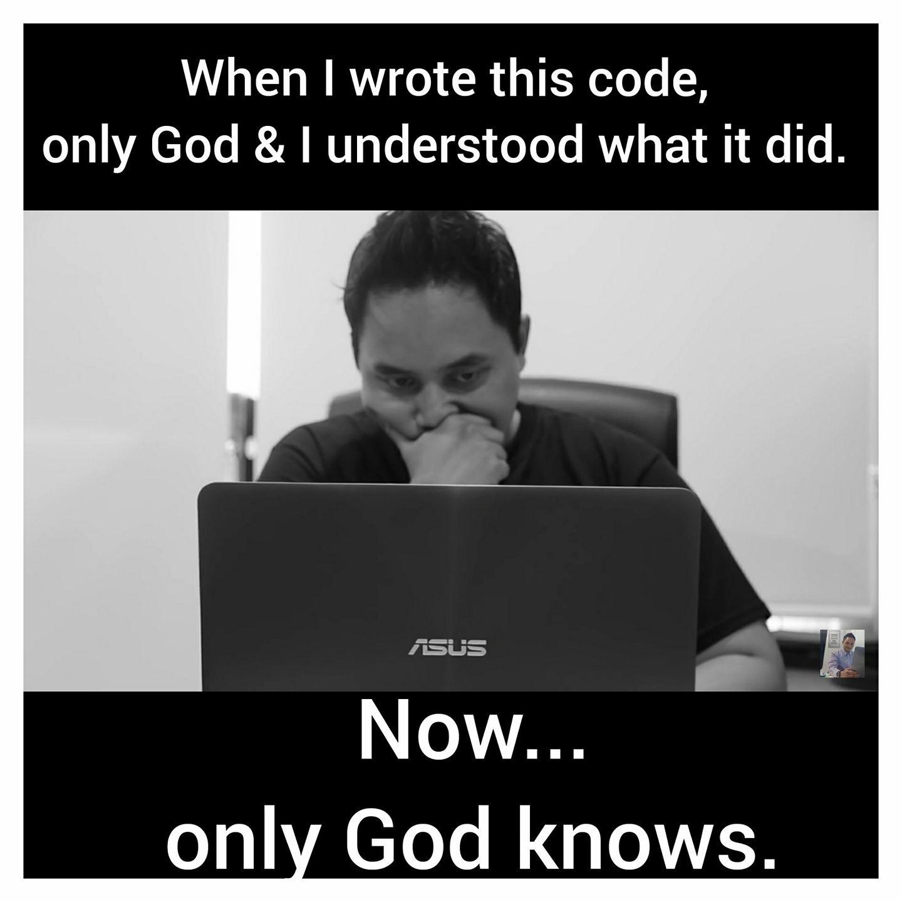

```{r setup, include=FALSE}
knitr::opts_chunk$set(echo = TRUE)

try({
  pkgs <- c("naijR", "purrr")
  pkgNoDey <- !sapply(pkgs, requireNamespace, quietly = TRUE)
  install.packages(pkgs[pkgNoDey], repos = 'https://cran.rstudio.com')
}, silent = TRUE
)

sections <- list(
  what = "What is R?",
  get = "Getting R",
  syntax = "R syntax",
  use = "Practical Uses",
  prospect = "Prospects",
  `next` = "What Next?"
)

# adder <- function(add) {
#   sec <- 0L
#   function() {
#     sec <<- sec + add
#     sec
#   }
# }
# add_one <- adder(1)
```


## Outline

```{r outline_bullets, results='asis', echo=FALSE}
print_bullet <- function(x) {
  stopifnot(is.character(x))
  cat("-", x, fill = TRUE)
}

try(purrr::walk(sections, print_bullet), silent = TRUE)
```


# `r sections[['what']]`

---

- R is a programming language that is used for analysing data
- Data is becoming more important, so tools like R are more relevant
- Knowing how to manipulate, organize and analyze data is becoming an important skill set.
- Data science is one of the high-paying and highly valued jobs in current times.
- Many jobs can be done 100% remotely.

# `r sections[['get']]`

---

- Installing R is very easy and it's 100% free!
- Numerous free resources and courses.
- Global community to support you in your growth.
- All you need is passion to learn it.
- Easy to learn: After a few weeks can use for any project.

# `r sections[['syntax']]`
## Create objects and name them

```
name <- object
```
where `<-` is the **assignment operator**. It binds a name to an object.

For example, to create an object named `life` that has the value `42`

```{r}
life <- 42
life
```
---

**Comments**: Anything after a `#` is a comment.

- In programming languages, they are used for writing normal language text in the source file. 
- They are used mainly to explain what the code is doing or explain why the programmer decided to do a particular.
- Comments help other programmers understand the code
- Comments help you to remember why you wrote the code the way you did it.

---

<div id=imgC align="center">
{width=500px}
</div>


---

R uses the **combine** function `c()` to join together values of the same type i.e. numbers, characters, etc into a collection called a vector.

```{r vector}
# Create a vector by combining together many numbers
many <- c(life, 54, 65, 76, 87, 98, 102)

# Print out the value of the object
many
```
## Data structures
## Operators

- Arithmetic operators

```{r arithmetic}
x <- 8
y <- 2

x + y
x - y
x * y   # multiply
x / y   # divide
```

---

- Comparison operators

```{r comparison}
x == y
x != y
x > y
x > y
```

----

- Logical operators

 && - **and**
 || = **or**
 
```{r logical}
(x == y) && (x > y)
(x == y) || (x > y)
```

## Control flow
### Conditionals

- `if`, `else if`, `else`: These can be used to instruct a particular part of the code to be run or not run.

- For example take this instruction:  
*If `x` is greater than `y`, say "Yes o!", otherwise say "No way!"*

---

- In code it will look like this:

``` {r control_flow, eval = FALSE}
# Note that x is 8 and y is 2
if (x > y) {
  "Yes o!"
} else {
  "No way!"
}
```
*When the result inside if() is `TRUE`, everything in between the braces is executed. If it is `FALSE`, everything in the `else` portion is executed*  
What is the result of the above code?

---

### Loops
Loops allow us to run a code block over and over again.


For further explanations on loops, read **[this article](https://adventureswithr.wordpress.com/2020/08/11/r-loops/)**.

# `r sections[['use']]`
## Read in a file
Example read a table from a CSV file called *mockdata.csv*.


---

Use `read.csv()` function to read the file into R and at the same time create an object

```{r read_csv}
mydata <- read.csv("mockdata.csv")

# Print out the data inside R
mydata
```


## Wrangle data
Change the column names

*Task: Use title case for all the column headers*

```{r wrangle-1}
colnames(mydata)
colnames(mydata) <- c("Number", "Key", "Age", "Sex", "Height", "Location")
colnames(mydata)
```

---

Remove a column

*Task: "The Serial numbers are of no use to me. Remove them."*

```{r wrangle-2}
ncol(mydata)   # number of columns
mydata["Number"] <- NULL
ncol(mydata)
```

---

Filter a data for a particular term

*Task: Give me only the records of those from Abuja*

```{r wrangle-3}
nrow(mydata)
abj.only <- subset(mydata, Location == "Abuja")
nrow(abj.only)
```

## Explore data
Sometimes you don't want to personally look at the data. In fact, sometimes you want your program to look at the data.


---

### Check the structure

```{r explore_str}
dim(mydata)
str(mydata)
```

---

### Summarize the data

```{r explore_summ}
summary(mydata)
```

---

### Compute some stats

```{r}
# Average age
mean(mydata$Age)

# Tallest person
max(mydata$Height)

# Most from location (not numeric, tabulate first to get counts)
tbl <- table(mydata$Location)
max(tbl)
```

## Visualize data
One of R strongest suits is the ability to draw superb graphs.

```{r}
barplot(tbl)
```

# `r sections[['prospect']]`
## Web applications
R can be used to create dynamic web pages for interactive data analysis.

- This means that you can use R code to work with languages like HTML, CSS and JavaScript to create such pages.
- For this we have a web framework known as **Shiny**.
- See a Shiny application we developed to explore global COVID-19 data **[here](https://victorordu.shinyapps.io/covid/)**.

## Database administration
R can be used to create as well as query databases.
It works very well with DBMS like SQLite, MySQL, SQL Server, etc
R can also be used to connect to massive Big Data such as Sparx.

---

## Generate documents
Using what is known as R Markdown, we can create dynamic documents.
The value of this is that R code is placed right inside a document. When it is evaluated, all the results of the code are placed in the resulting document.
A good is example is this presentation. It is created entirely in R Markdown. Code can be viewed [here](https://github.com/BroVic/r-overview/blob/master/r-overview.Rmd).

---

## Draw maps
As part of its graphical abilities, R can draw maps.
There are packages that have been developed to draw different types of maps.
We developed a package called **_naijR_** that can draw maps for Nigeria.

```{r, warning=FALSE}
try(naijR::map_ng(title = "Map of Nigeria"), silent = TRUE)
```

---

Numerous packages that do different things e.g.
- build websites
- scrape web pages

For a comprehensive list of the use of R in various disciplines, visit [cRAN Task Views](https://cran.r-project.org/web/views/).


# `r sections[['next']]`

---

- Ask questions
- Follow our blog
- Follow us on Twitter
- Join our Slack group


